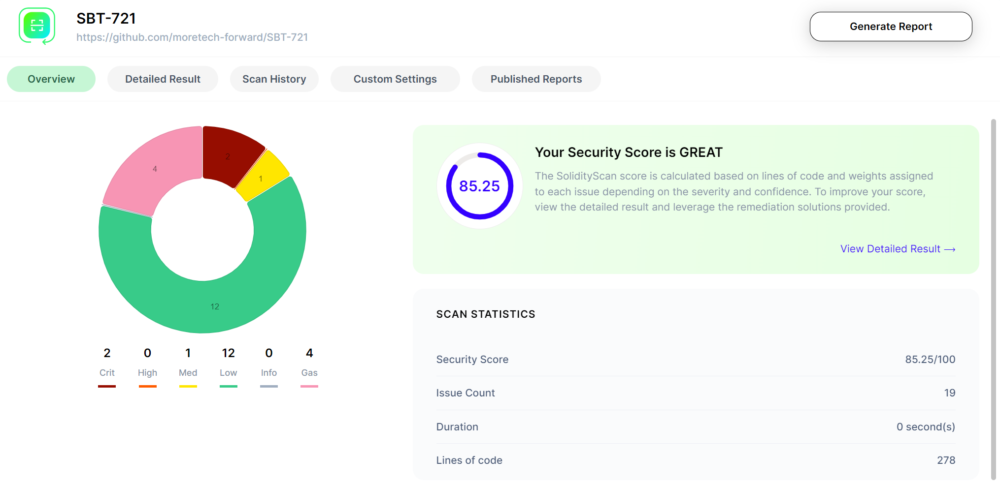

# Audit

## Findings

### [solidityscan.com](solidityscan.com)




#### CRIT

##### ERC721 SAFEMINT REENTRANCY

- [Description](https://blocksecteam.medium.com/when-safemint-becomes-unsafe-lessons-from-the-hypebears-security-incident-2965209bda2a)

But in our case, the function is protected by the onlyOwner modifier, which makes it impossible to perform the attack.

Attack example
`owner` -> `safeMint` (SBT) -> `onERC721Received`(HackContract) -> `safeMint` (SBT) -> `“UNAUTHORIZED”` (`msg.sender` = HackContract)

#### MEDIUM

The array is checked for equality of lengths, and it is assumed that a person will not contribute too many addresses per race for mint tokens

There will be a warning about it at the front

#### LOW

You can ignore it, since all errors are compiler version related, and the internal functions are taken from the tested OpenZeppelin library

#### GAS

Vulnerabilities were tested and accepted as false positives

### Slither

```sh
slither .
```

#### [Contracts that lock Ether](https://github.com/crytic/slither/wiki/Detector-Documentation#contracts-that-lock-ether)

It appeared because SolidityScan was complaining about gas optimizations and asked to make `payable` functions (such a function does not check that `msg.value == 0` and therefore costs cheaper)

The implication is that users will not send `msg.value` to the contract, hence ether will not be blocked.

#### [Reentrancy vulnerabilities](https://github.com/crytic/slither/wiki/Detector-Documentation#reentrancy-vulnerabilities-1)

- Described above in `ERC721 SAFEMINT REENTRANCY`

```
Reentrancy in Soulbound.safeBatchMint(address[],string[]) (contracts/SBT.sol#39-51):
        External calls:
        - _safeMint(to[i],tokenId) (contracts/SBT.sol#48)
                - require(bool,string)(to.code.length == 0 || ERC721TokenReceiver(to).onERC721Received(msg.sender,address(0),id,) == ERC721TokenReceiver.onERC721Received.selector,UNSAFE_RECIPIENT) (contracts/ERC721/ERC721.sol#164-174)
```
